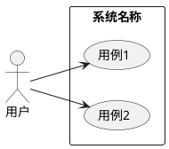
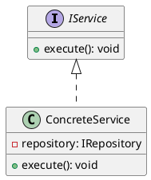
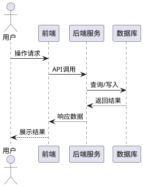
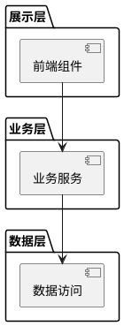
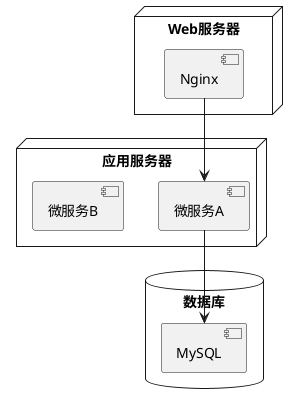
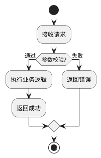
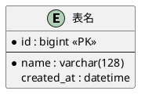

# 设计文档撰写 Skill

## 质量目标

所有输出必须满足以下正向导向：

1. 无遗漏：覆盖所有功能场景，无质量问题
2. 可演进：方案包含架构演进考虑，可指导编码实现
3. 规范完整：满足文档规范，DFX 考虑全面
4. 工程卓越：主动使用 UML（PlantUML 语法）输出类图、时序图；运用设计模式，满足 SOLID 原则；追求高内聚低耦合、可复用、易扩展、易维护

## 文档结构

标准设计文档包含以下章节，按需裁剪：

| 章节 | 内容 | 是否必选 |
|------|------|----------|
| 第一章 需求背景 | 业务痛点、项目目标 | ✅ |
| 第二章 需求分析 | 功能拆解、用户故事、验收标准 | ✅ |
| 第三章 4+1视图 | 用例视图、逻辑视图、过程视图、开发视图、部署视图 | ✅ |
| 第四章 流程设计 | 核心业务流程（活动图/流程图） | ✅ |
| 第五章 数据库设计 | ER 图、表结构定义 | ✅ |
| 第六章 DFX分析 | 性能、可靠性、安全、可维护性等 | ✅ |
| 接口设计 | RESTful API 定义、请求/响应示例 | 可选 |
| 表设计 | 详细字段定义、索引策略 | 可选 |
| 测试分析 | 测试场景、步骤、检查点 | 可选 |

完整模板及 PlantUML 图示示例见 [references/template.md](references/template.md)。

## 撰写工作流

### 1. 收集输入

向用户确认以下关键信息（缺失则主动询问）：

• 需求背景与痛点

• 核心功能列表

• 涉及的系统/服务边界

• 技术栈约束（语言、框架、中间件、数据库）

• 非功能性要求（性能指标、并发量、SLA）

• 是否需要可选章节（接口设计、表设计、测试分析）

### 2. 逐章撰写

按文档结构顺序逐章输出，每章遵循以下原则：

第一章 需求背景
• 用 2-5 条简明要点说明业务痛点和项目目标

• 避免空泛描述，每条痛点需具体可验证

第二章 需求分析
• 按功能模块拆分，每个模块说明：功能描述、用户故事、验收标准

• 功能点需可追溯到需求背景中的痛点

第三章 4+1视图

输出完整的 4+1 架构视图，所有图表使用 PlantUML 语法：

• 用例视图：展示参与者与系统用例关系

• 逻辑视图：类图展示核心领域模型及关系，体现 SOLID 原则

• 过程视图：时序图展示核心交互流程

• 开发视图：包图或组件图展示模块划分

• 部署视图：部署图展示物理部署架构

第四章 流程设计
• 使用 PlantUML 活动图描述核心业务流程

• 标注分支条件、异常处理路径

第五章 数据库设计
• 使用 PlantUML ER 图展示表关系

• 列出表清单：表名、功能描述

• 详细表结构放在「表设计」可选章节

第六章 DFX 分析
• 以表格形式列出 DFX 问题，详见 [references/dfx-checklist.md](references/dfx-checklist.md)

• 每条需包含：问题、类别、描述、解决方案

| DFX问题 | 问题类别 | 问题描述 | 解决方案 | 备注 |
|---------|---------|---------|---------|------|
| xxx | 性能/可靠性/安全/... | 具体描述 | 具体方案 | |

接口设计（可选）
• 按 RESTful 规范定义，每个接口包含：HTTP Method、URL、请求体示例（JSON）、响应体示例（JSON）、错误码说明

表设计（可选）
• 每张表列出完整字段定义：字段名、类型、是否必填、默认值、说明

• 标注主键、外键、索引策略

测试分析（可选）
• 按功能模块组织，每个测试用例包含：

| 类型 | 测试场景 | 测试步骤 | 检查点 |
|------|---------|---------|--------|
| 正常场景/异常场景 | 场景描述 | 步骤列表 | 验证点 |

### 3. 自检清单

完成撰写后，按以下清单自检并输出检查结果：

• [ ] 所有功能场景均已覆盖，无遗漏

• [ ] 4+1 视图完整且一致，各视图之间无矛盾

• [ ] 类图体现 SOLID 原则（单一职责、开闭、里氏替换、接口隔离、依赖倒置）

• [ ] 时序图覆盖所有核心交互流程

• [ ] 数据库设计满足第三范式或有合理反范式说明

• [ ] DFX 分析覆盖性能、可靠性、安全性、可维护性

• [ ] 接口设计与数据库设计一致

• [ ] 所有 UML 图使用 PlantUML 语法，可直接渲染

• [ ] 设计方案支持架构演进，扩展性良好

## 评审模式

当用户提供已有设计文档并要求评审时：

1. 按自检清单逐项评审
2. 指出缺失章节或不完整内容
3. 检查架构设计是否满足高内聚低耦合
4. 检查是否遵循 SOLID 原则
5. 检查 DFX 分析是否全面
6. 给出具体改进建议和示例代码/图表

## 文档输出

设计文档输出写入到Markdown文件中

自检清单不用输出到文件中