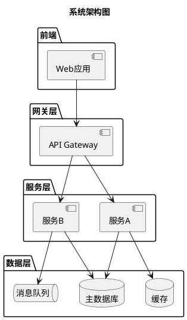
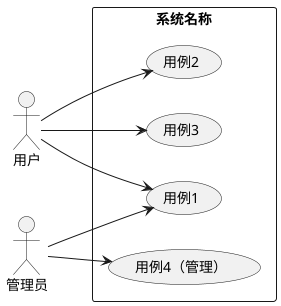
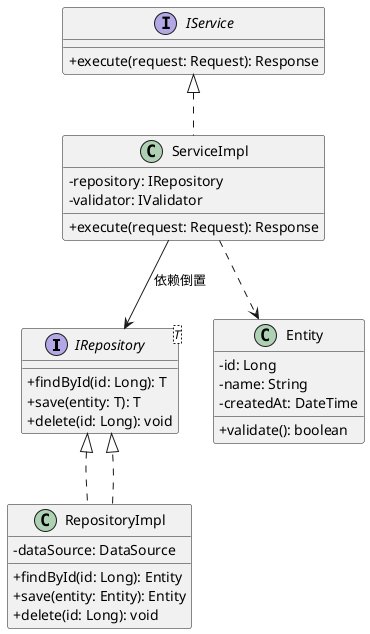
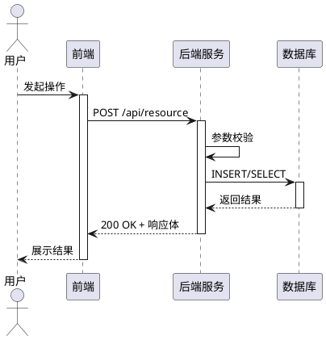
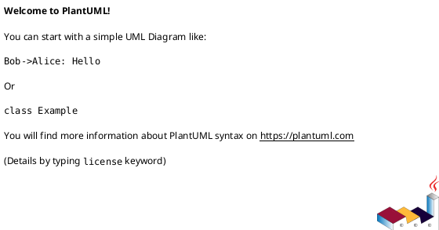
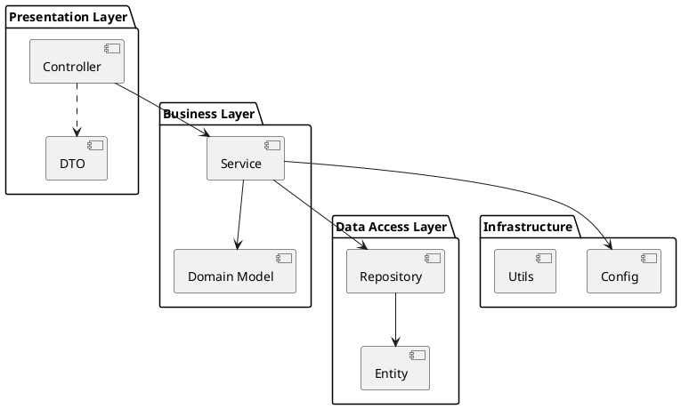
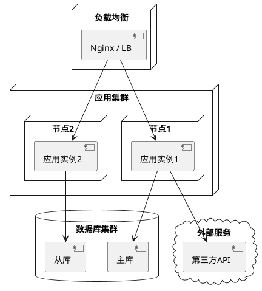
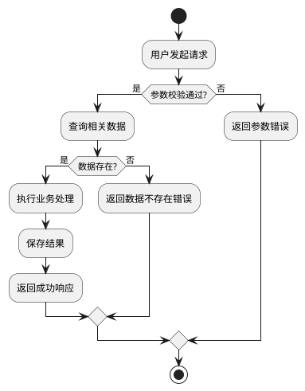
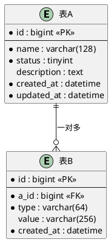

# [项目/功能名称] 软件设计文档

> 版本：v1.0  
> 作者：  
> 日期：  
> 状态：草稿 / 评审中 / 已定稿

---

## 第一章 需求背景

<!-- 用简明要点列出业务痛点和项目目标，每条具体可验证 -->

1. [痛点1：现状描述 → 导致的问题]
2. [痛点2：现状描述 → 导致的问题]
3. [目标：期望达成的效果]

---

## 第二章 需求分析

### 2.1 [功能模块1名称]

功能描述：[简要说明该模块做什么]

用户故事：作为[角色]，我希望[操作]，以便[价值]。

验收标准：
• [标准1]

• [标准2]


### 2.2 [功能模块2名称]

功能描述：[简要说明]

用户故事：作为[角色]，我希望[操作]，以便[价值]。

验收标准：
• [标准1]

• [标准2]


---

## 第三章 4+1 视图

### 3.1 系统架构总览

<!-- 使用 PlantUML 组件图展示完整系统架构 -->



### 3.2 用例视图

<!-- 展示系统参与者和核心用例 -->



### 3.3 逻辑视图

<!-- 类图展示核心领域模型，体现 SOLID 原则 -->



### 3.4 过程视图

<!-- 时序图展示核心交互流程 -->

#### 3.4.1 [流程1名称] 时序图



#### 3.4.2 [流程2名称] 时序图



### 3.5 开发视图

<!-- 包图展示模块结构和依赖关系 -->



### 3.6 部署视图



---

## 第四章 流程设计

### 4.1 [核心流程1名称]



### 4.2 [核心流程2名称]


---

## 第五章 数据库设计

### 5.1 ER 图



### 5.2 表清单

| 表名称 | 表功能描述 |
|--------|-----------|
| t_xxx_a | [表A功能描述] |
| t_xxx_b | [表B功能描述] |

---

## 第六章 DFX 分析

| DFX问题 | 问题类别 | 问题描述 | 解决方案 | 备注 |
|---------|---------|---------|---------|------|
| [问题1] | 性能 | [具体描述] | [具体方案] | |
| [问题2] | 可靠性 | [具体描述] | [具体方案] | |
| [问题3] | 安全 | [具体描述] | [具体方案] | |
| [问题4] | 可维护性 | [具体描述] | [具体方案] | |

---

## 接口设计（可选）

### API-1：[接口名称]

• Method: POST / GET / PUT / DELETE

• URL: `/v1/resource/action`

• 描述: [接口用途]


请求体:
```json
{
  "field1": "string",
  "field2": 0
}
```

响应体:
```json
{
  "code": 200,
  "message": "success",
  "data": {}
}
```

错误码:

| 错误码 | 说明 |
|-------|------|
| 400 | 参数错误 |
| 404 | 资源不存在 |
| 500 | 服务器内部错误 |

---

## 表设计（可选）

### t_xxx_a

| 字段名 | 类型 | 是否必填 | 默认值 | 说明 |
|--------|------|---------|--------|------|
| id | bigint | 是 | 自增 | 主键 |
| name | varchar(128) | 是 | - | 名称 |
| status | tinyint | 是 | 0 | 状态：0-禁用 1-启用 |
| description | text | 否 | NULL | 描述 |
| created_at | datetime | 是 | CURRENT_TIMESTAMP | 创建时间 |
| updated_at | datetime | 是 | CURRENT_TIMESTAMP | 更新时间 |

索引:
| 索引名 | 字段 | 类型 | 说明 |
|--------|------|------|------|
| pk_id | id | PRIMARY | 主键 |
| idx_name | name | NORMAL | 名称查询 |
| idx_status | status | NORMAL | 状态筛选 |

---

## 测试分析（可选）

### [功能模块1] 测试用例

| 类型 | 测试场景 | 测试步骤 | 检查点 |
|------|---------|---------|--------|
| 正常场景 | [场景描述] | 1. [步骤1]<br>2. [步骤2]<br>3. [步骤3] | [预期结果] |
| 异常场景 | [场景描述] | 1. [步骤1]<br>2. [步骤2] | [预期结果] |